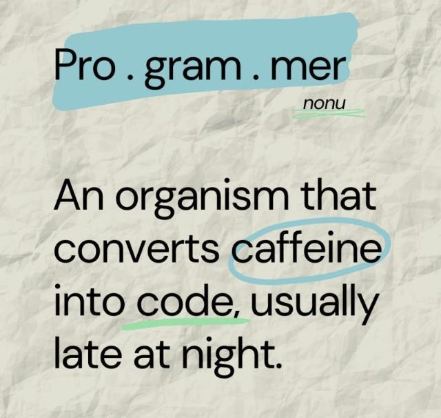

<h1> Hey! Welcome to my GitHub world.</h1>

[![](https://img.shields.io/badge/web-site-blue.svg?logo=data:image/svg+xml;base64,PCFET0NUWVBFIHN2ZyBQVUJMSUMgIi0vL1czQy8vRFREIFNWRyAxLjEvL0VOIiAiaHR0cDovL3d3dy53My5vcmcvR3JhcGhpY3MvU1ZHLzEuMS9EVEQvc3ZnMTEuZHRkIj4KDTwhLS0gVXBsb2FkZWQgdG86IFNWRyBSZXBvLCB3d3cuc3ZncmVwby5jb20sIFRyYW5zZm9ybWVkIGJ5OiBTVkcgUmVwbyBNaXhlciBUb29scyAtLT4KPHN2ZyBoZWlnaHQ9IjgwMHB4IiB3aWR0aD0iODAwcHgiIHZlcnNpb249IjEuMSIgaWQ9Il94MzJfIiB4bWxucz0iaHR0cDovL3d3dy53My5vcmcvMjAwMC9zdmciIHhtbG5zOnhsaW5rPSJodHRwOi8vd3d3LnczLm9yZy8xOTk5L3hsaW5rIiB2aWV3Qm94PSIwIDAgNTEyIDUxMiIgeG1sOnNwYWNlPSJwcmVzZXJ2ZSIgZmlsbD0iIzAwMDAwMCI+Cg08ZyBpZD0iU1ZHUmVwb19iZ0NhcnJpZXIiIHN0cm9rZS13aWR0aD0iMCIvPgoNPGcgaWQ9IlNWR1JlcG9fdHJhY2VyQ2FycmllciIgc3Ryb2tlLWxpbmVjYXA9InJvdW5kIiBzdHJva2UtbGluZWpvaW49InJvdW5kIi8+Cg08ZyBpZD0iU1ZHUmVwb19pY29uQ2FycmllciI+IDxzdHlsZSB0eXBlPSJ0ZXh0L2NzcyI+IC5zdDB7ZmlsbDojZmZmZmZmO30gPC9zdHlsZT4gPGc+IDxwYXRoIGNsYXNzPSJzdDAiIGQ9Ik0yNTUuOTk0LDAuMDA2QzExNC42MDcsMC4wMTMsMC4wMTIsMTE0LjYxMiwwLDI1NmMwLjAxMiwxNDEuMzg3LDExNC42MDcsMjU1Ljk4NiwyNTUuOTk0LDI1NS45OTQgQzM5Ny4zOTMsNTExLjk4Niw1MTEuOTkyLDM5Ny4zODcsNTEyLDI1NkM1MTEuOTkyLDExNC42MTIsMzk3LjM5MywwLjAxMywyNTUuOTk0LDAuMDA2eiBNOTcuNjA3LDk3LjYxMiBjMjMuMzQtMjMuMzI4LDUxLjc2MS00MS40NzUsODMuNDU1LTUyLjcyNWMtMTUuMTgzLDE4LjM3NS0yNy44NCw0MS45MDYtMzcuNzU3LDY5LjExNkg4Mi43NzIgQzg3LjQ1MiwxMDguMzA4LDkyLjM5NiwxMDIuODI0LDk3LjYwNyw5Ny42MTJ6IE02NS42MTIsMTM4LjAwM2g2OS45ODZjLTkuMDA4LDMxLjkyOS0xNC40MSw2Ny44MzQtMTUuMzYzLDEwNS45OTdIMzIuMzI3IEMzNC4zNzQsMjA1LjE5Niw0Ni4zLDE2OS4wODgsNjUuNjEyLDEzOC4wMDN6IE02NS42MTIsMzczLjk5N0M0Ni4zLDM0Mi45MTIsMzQuMzc0LDMwNi44MDQsMzIuMzI3LDI2OGg4Ny45OTEgYzAuOTYxLDM4LjEyNCw2LjIxLDc0LjA5MiwxNS4yMDYsMTA1Ljk5OEg2NS42MTJ6IE05Ny42MDcsNDE0LjM4NmMtNS4yMTEtNS4yMTEtMTAuMTU2LTEwLjY5NS0xNC44MzYtMTYuMzloNjAuNTczIGM0LjI4LDExLjc3NCw5LjAxOSwyMi45NDQsMTQuMzEyLDMzLjIxYzYuOTU0LDEzLjQzOCwxNC43NTgsMjUuNDY4LDIzLjM0OCwzNS44OUMxNDkuMzMyLDQ1NS44NDYsMTIwLjkzMSw0MzcuNjk5LDk3LjYwNyw0MTQuMzg2eiBNMjQzLjk5OCw0NzkuNjY3Yy0zLjc0Ni0wLjE5Ni03LjQ2OS0wLjQ3Ny0xMS4xNjQtMC44NmMtNS44OS0yLjY0LTExLjcyMi02LjI1LTE3LjUtMTAuOTYxIGMtMTcuNjMyLTE0LjM1OS0zMy45NzYtMzguNjcxLTQ2LjM5OC02OS44NWg3NS4wNjFWNDc5LjY2N3ogTTI0My45OTgsMzczLjk5N2gtODMuNDM2Yy05LjQ3Ny0zMS4xNzEtMTUuMzE2LTY3LjMxMS0xNi4zMjgtMTA1Ljk5OCBoOTkuNzYzVjM3My45OTd6IE0yNDMuOTk4LDI0NEgxNDQuMzFjMS4wMDgtMzguNzEsNi44NzUtNzQuODE5LDE2LjM1OS0xMDUuOTk3aDgzLjMzVjI0NHogTTI0My45OTgsMTE0LjAwM2gtNzQuOTUxIGMzLjEwOS03Ljc5LDYuMzY3LTE1LjMxMiw5LjkzNC0yMi4xOTVjMTAuNjQtMjAuNjI1LDIzLjE3LTM2Ljg5LDM2LjM1NC00Ny42NTZjNS43NzctNC43MSwxMS42MDktOC4zMiwxNy41LTEwLjk2IGMzLjY5NS0wLjM4Miw3LjQxNy0wLjY2NCwxMS4xNjQtMC44NTlWMTE0LjAwM3ogTTQ0Ni4zOTIsMTM4LjAwM2MxOS4zMTIsMzEuMDg1LDMxLjIzNCw2Ny4xOTQsMzMuMjgxLDEwNS45OTdoLTg3Ljk5MSBjLTAuOTYxLTM4LjEyNC02LjIxLTc0LjA5Mi0xNS4yMS0xMDUuOTk3SDQ0Ni4zOTJ6IE00MTQuMzkzLDk3LjYxMmM1LjIxMSw1LjIxMSwxMC4xNTYsMTAuNjk2LDE0LjgzNiwxNi4zOTFoLTYwLjU3NyBjLTQuMjgxLTExLjc3My05LjAyMy0yMi45NDUtMTQuMzEyLTMzLjIxYy02Ljk1My0xMy40MzctMTQuNzU4LTI1LjQ2OC0yMy4zNDctMzUuODlDMzYyLjY2OCw1Ni4xNiwzOTEuMDY1LDc0LjMwMSw0MTQuMzkzLDk3LjYxMnogTTI2Ny45OTgsMzIuMzMzYzMuNzQ2LDAuMTk1LDcuNDY5LDAuNDg0LDExLjE2LDAuODU5YzUuODksMi42NDksMTEuNzIzLDYuMjUsMTcuNTA0LDEwLjk2IGMxNy42MzYsMTQuMzU5LDMzLjk3NiwzOC42NzEsNDYuMzk3LDY5Ljg1aC03NS4wNjFWMzIuMzMzeiBNMjY3Ljk5OCwxMzguMDAzaDgzLjQzNmM5LjQ3NiwzMS4xNzEsMTUuMzIsNjcuMzEsMTYuMzI4LDEwNS45OTcgaC05OS43NjRWMTM4LjAwM3ogTTI2Ny45OTgsMjY4aDk5LjY4NWMtMS4wMDcsMzguNzEtNi44NzQsNzQuODE4LTE2LjM1OSwxMDUuOTk4aC04My4zMjZWMjY4eiBNMjk2LjY2MSw0NjcuODQ2IGMtNS43ODEsNC43MTEtMTEuNjE0LDguMzEzLTE3LjUwNCwxMC45NjFjLTMuNjkxLDAuMzc1LTcuNDE0LDAuNjY0LTExLjE2LDAuODZ2LTgxLjY3aDc0Ljk1MSBjLTMuMTA5LDcuNzg5LTYuMzY3LDE1LjMxMi05LjkzMywyMi4xOTVDMzIyLjM3Niw0NDAuODE2LDMwOS44NDUsNDU3LjA4MSwyOTYuNjYxLDQ2Ny44NDZ6IE00MTQuMzkzLDQxNC4zODYgYy0yMy4zMzYsMjMuMzI4LTUxLjc2NCw0MS40NzYtODMuNDU5LDUyLjcyNWMxNS4xODctMTguMzc1LDI3LjgzNS00MS45MDUsMzcuNzU3LTY5LjExNWg2MC41MzggQzQyNC41NDgsNDAzLjY5Miw0MTkuNjA0LDQwOS4xNzYsNDE0LjM5Myw0MTQuMzg2eiBNNDQ2LjM5MiwzNzMuOTk3aC02OS45OThjOS4wMDgtMzEuOTI5LDE0LjQxNC02Ny44NDIsMTUuMzY3LTEwNS45OThoODcuOTEyIEM0NzcuNjI2LDMwNi44MDQsNDY1LjcwNCwzNDIuOTEyLDQ0Ni4zOTIsMzczLjk5N3oiLz4gPC9nPiA8L2c+Cg08L3N2Zz4=)](https://www.simonemandola.com/)
[![](https://img.shields.io/badge/mail-me-blue.svg?logo=data:image/svg+xml;base64,PCFET0NUWVBFIHN2ZyBQVUJMSUMgIi0vL1czQy8vRFREIFNWRyAxLjEvL0VOIiAiaHR0cDovL3d3dy53My5vcmcvR3JhcGhpY3MvU1ZHLzEuMS9EVEQvc3ZnMTEuZHRkIj4KDTwhLS0gVXBsb2FkZWQgdG86IFNWRyBSZXBvLCB3d3cuc3ZncmVwby5jb20sIFRyYW5zZm9ybWVkIGJ5OiBTVkcgUmVwbyBNaXhlciBUb29scyAtLT4KPHN2ZyB3aWR0aD0iODAwcHgiIGhlaWdodD0iODAwcHgiIHZpZXdCb3g9IjAgMCAyNCAyNCIgZmlsbD0ibm9uZSIgeG1sbnM9Imh0dHA6Ly93d3cudzMub3JnLzIwMDAvc3ZnIj4KDTxnIGlkPSJTVkdSZXBvX2JnQ2FycmllciIgc3Ryb2tlLXdpZHRoPSIwIi8+Cg08ZyBpZD0iU1ZHUmVwb190cmFjZXJDYXJyaWVyIiBzdHJva2UtbGluZWNhcD0icm91bmQiIHN0cm9rZS1saW5lam9pbj0icm91bmQiLz4KDTxnIGlkPSJTVkdSZXBvX2ljb25DYXJyaWVyIj4gPHBhdGggZD0iTTQgNy4wMDAwNUwxMC4yIDExLjY1QzExLjI2NjcgMTIuNDUgMTIuNzMzMyAxMi40NSAxMy44IDExLjY1TDIwIDciIHN0cm9rZT0iI2ZmZmZmZiIgc3Ryb2tlLXdpZHRoPSIyIiBzdHJva2UtbGluZWNhcD0icm91bmQiIHN0cm9rZS1saW5lam9pbj0icm91bmQiLz4gPHJlY3QgeD0iMyIgeT0iNSIgd2lkdGg9IjE4IiBoZWlnaHQ9IjE0IiByeD0iMiIgc3Ryb2tlPSIjZmZmZmZmIiBzdHJva2Utd2lkdGg9IjIiIHN0cm9rZS1saW5lY2FwPSJyb3VuZCIvPiA8L2c+Cg08L3N2Zz4=)](mailto:s.mandola.design@hotmail.com)

## Languages and Tools

    

## My Stats

    

## Top repos

    
    
    
    

### Show your appreciation by starring ⭐ my repositories.

